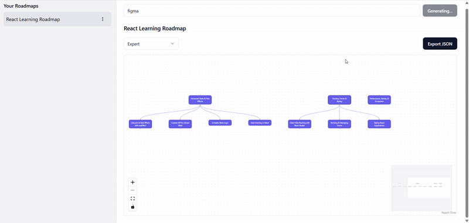

## AI Roadmap

An app that will provide you with a learning roadmap, generated by an LLM, based on the topic
that you input. <br>
Eg. Add - 'backend development' <br>
Try it out => https://ai-roadmap-khaki.vercel.app

### 🎥 Demo



### Setup
1. Clone the repository <br>
```git clone https://github.com/yourusername/ai-learning-map.git```

2. Navigate into the project folder <br>
```cd ai-learning-map```

3. Install dependencies <br>
    <code>
    npm install
    or 
    yarn install
    </code>

4. Create a .env.local file in the root directory and add your environment variables (for example): <br>
   ``` OPENAI_API_KEY=your_openai_api_key_here```

5. Run the development server <br>
    <code>
    npm run dev
    or
    yarn dev
    </code>

6. Open your browser and visit <br>
    ```http://localhost:3000 ```


### Simple features

- Topic Input and Generation : simple textbox where any topic can be entered and a simple roadmap
can be generated. 
- AI powered roadmap generation : the app will use an LLM to breakdown a topic into key learning areas and
subtopics
- Interactive visualization : using a flowgraph interface where nodes are connected visually and users can click/hover/expand 
the nodes. 
- Saving user's roadmaps : the roadmaps that the user's have created in the past can be stored in their local storage, so 
that they can access their previous roadmaps
    <pre>
    User enters topic → Call LLM API → Render roadmap → Save JSON in localStorage
            ↑                                                ↓
            └──────── Load from localStorage if exists ──────┘
    </pre>
- Deleting past roadmaps from the storage


### Extended features:
- Node expansion : a node can be clicked and expanded to get a deeper subtopic
- Learning level filter : dropdown or buttons for beginner / intermediate / advanced
- Export: export the roadmap to a JSON file


### LLM integration:

For this project, Google's gemini-2.5-flash model was used. A prompt to generate a roadmap with 
with topic and node level distribution, returning a JSON document that is stored in the local storage
and used to then visualise the roadmap for the user

### Approach:

A simple approach - user will add enter something that they want the roadmap for, the AI will generate the 
roadmap and send it back in a JSON format which will then be stored in the user's local storage and visually
displayed to the user as nodes and sub-nodes. All the features are implemented as mentioned above, with levels
of diificulty, export and revealing subnodes. 

### Tradeoffs/Improvements:

- Gemini 2.5 flash being used as it is free. A better model will give better and more in-depth results. 
- User specific accounts can be created along with a database to provide a longer persistence of data. Currently, 
everyting is being stored in local storage
- Suggested roadmaps can be added
- A ranking based system to vote for public roadmaps that users create and view the most popular ones. 